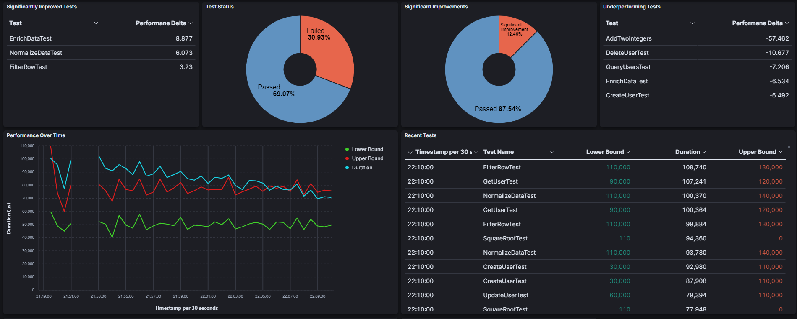
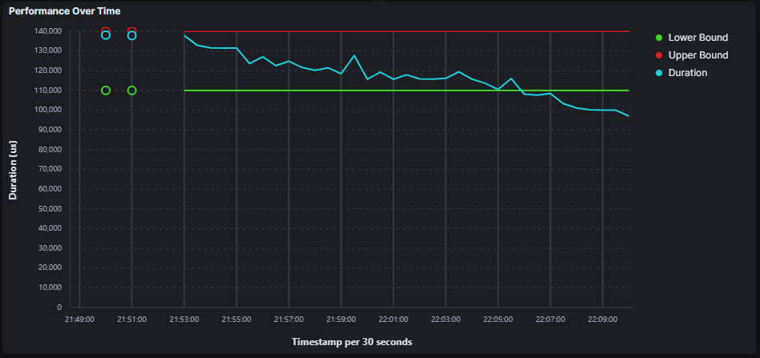
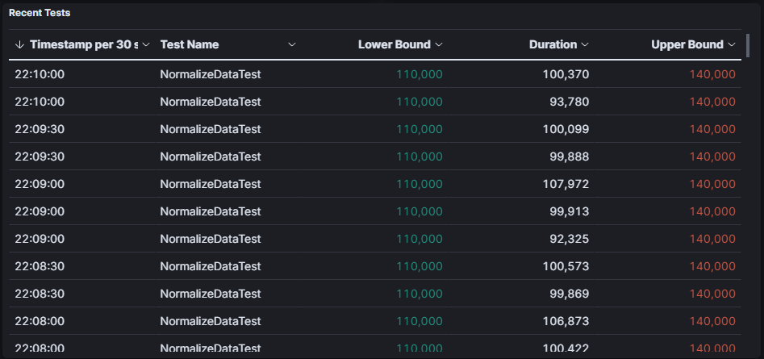

## Overview

Set standards for your software. 

This repository provides a benchmarking framework for the C++ language. Set standards, track progress, and aggregate results
in an ELK stack.

The goal of this project is to track **relative performance**, not absolute performance. No two runs, even on the same machine,
will yield the same exact results. This project attempts to highlight significant trends and major anomalies by allowing 
developers to constantly benchmark their software.

The screenshot below shows the default dashboard that comes with this project. It provides basic information about
which tests have outperformed expectations and which have underperformed.



The line graph, in the screenshot above, becomes more useful when you filter on a single test. In the screenshot below
we filtered by `TestName : NormalizeDataTest` and this is what our line graph looked like...



And then our table, gave us some insight into individual results that could then be further filtered and organized.



## Related Benchmarkr Projects

- [Benchmarkr Jetbrains Plugin](https://github.com/tnweiss/benchmarkr-jetbrains-plugin): Jetbrains plugin for Intellij and CLION that makes it easier to run individual tests from the gutter
- [Benchmarkr Configuration](https://github.com/tnweiss/benchmarkr-configuration): Centralized configuration for elastic dashboards and indices

## Project Components

- `Common`: Includes common classes and functions used by `Dev` & `Benchmarkr`
- `Dev`: The development library used to create performance tests and manage results
- `Benchmarkr`: The executable used to initialize the local environment, initialize the ELK server, and upload results

## Third Party Libraries

The third party libraries used by this project are listed below.

- [JSON for Modern C++](https://github.com/nlohmann/json) we use the header only file `include/nlohmann/json.hpp`
- [Catch 2](https://github.com/catchorg/Catch2) this library is used for unit testing
- [Terminal](https://github.com/jupyter-xeus/cpp-terminal) used for color coding terminal output
- [ELK Client](https://github.com/tnweiss/elk-cpp) ELK Client Library used to interact with ELK's rest endpoints
- [SPDLOG](https://github.com/gabime/spdlog) logging library

## Usage

### Installing Benchmarkr

To install the benchmarkr binary, clone this repository

```shell
git clone https://github.com/tnweiss/Benchmarkr-cpp
cd benchmarkr-cpp
```

Create a build directory.

```shell
mkdir build && cd build
```

Build the source.

##### Windows

```shell
cmake ..
cmake --build . --config Release
cmake --install . --config Release
```

##### Linux

```shell
cmake ..
make
sudo make install
```

### CMAKE

Another simple option for including this library in your project is to use CMAKE.

Add the following section to your CMakeLists.txt ...

```cmake
FetchContent_Declare(benchmarkr-dev GIT_REPOSITORY https://github.com/tnweiss/Benchmarkr-cpp GIT_TAG v${BENCHMARKR_VERSION})
FetchContent_MakeAvailable(benchmarkr-dev)
```

## Benchmarkr

The benchmarkr executable provides management functionality for results. 

#### Initializing The Local Environment

The following command creates a `GlobalContext.json` file which is used to supplement test results with information
about the machine the results were generated from. This also sets up the Benchmarkr + results directory.

```shell
benchmarkr init-context
```

#### Initializing ELK

The following command creates an index, index pattern, and default dashboard in Elasticsearch and Kibana.

```shell
benchamrkr init
```

#### Uploading Results

The following command takes the results, merges them with the global context, uploads them to elasticsearch, then deletes
the files from the local filesystem

```shell
benchmarkr upload
```

#### Uploading Results In the Background

You can run this upload function in the background by creating a service that will run the following command...

```shell
benchmarkr upload-watch
```

## Benchmarkr Development

The benchmarkr-dev library will provide a main function as well as other setup MACRO's. The section below will walk
you through how to create a test.


### Skeleton

To start, create `test.cpp` and using cmake link it with `benchmarkr-dev`.

```c++
#include "benchmarkr.h"
```

```cmake
add_executable(benchmarkr_test test.cpp)
target_link_libraries(benchmarkr_test PRIVATE benchmarkr-dev)
```

After building, try running the test with ...

```shell
./benchmarkr_test
```

Nothing should happen because no tests are registered.

#### Registering a Test

Add a test to the source code using the `BENCHMARK` macro.

```c++
#include "benchmarkr.h"

BENCHMARK(MyFirstTest) {
  std::cout << "Hello World" << std::endl;
}
```

#### Adding Constraints to the Test

##### Lower Bound

The lower bound is used to mark significant performance improvement. If a test passes this threshold the user will
be notified of this significant improvement.

To set the lower bound of a test use the following macros
- `prop_LowerBound_s`
- `prop_LowerBound_ms`
- `prop_LowerBound_us`

#### Upper Bound

Upper Bound is used to set an upper limit to the performance of a function. If the duration of the test is greater than
this bound the test will fail. The user will be notified of this failure.

To set the upper bound of a test use the following macros
- `prop_UpperBound_s`
- `prop_UpperBound_ms`
- `prop_UpperBound_us`


To set Upper and Lower bounds for the tests, you can use the `prop_LowerBound_(ms/us/s)` and `prop_UpperBound_(ms/us/s)`
together as a second argument to the BENCHMARK Macro. In the example below I'm setting the lower bound to 90ms
and the upper bound to 120ms.

```c++
#include "benchmarkr.h"

BENCHMARK(MyFirstTest,
          (prop_LowerBound_ms( 90 ), prop_UpperBound_ms( 120 ))
          ) {
  std::cout << "Hello World" << std::endl;
}
```

#### Adding Metadata to the Test

You can also tag / add metadata to the test for further filtering in Kibana, just use the `prop_` macro. In the 
example below I added a custom category to the test.

```c++
#include "benchmarkr.h"

BENCHMARK(MyFirstTest,
          (prop_LowerBound_ms( 90 ), prop_UpperBound_ms( 120 ), prop_("category", "amazing"))
          ) {
  std::cout << "Hello World" << std::endl;
}
```

There's also a macro that lets you describe what the test is doing (`prop_Description`)

```c++
#include "benchmarkr.h"

BENCHMARK(MyFirstTest,
          (prop_LowerBound_ms( 90 ), prop_UpperBound_ms( 120 ), prop_("category", "amazing"), prop_Description("Testing Amazing Things"))
          ) {
  std::cout << "Hello World" << std::endl;
}
```

#### Hooks

The third argument in the `BENCHMARK` macro is a list of hooks. These hooks allow you to run custom code outside of the
measured test. One use case is a setup hook, that runs before the test. The other supported hook is a tear_down hook ...

```c++
#include "benchmarkr.h"

static void set_up (std::map<std::string, void*>& data) {
  std::cout << "Setup" << std::endl;
}

static void tear_down (std::map<std::string, void*>& data) {
  std::cout << "Teardown" << std::endl;
}

BENCHMARK(MyFirstTest,
          (prop_LowerBound_ms( 90 ), prop_UpperBound_ms( 120 ), prop_("category", "amazing"), prop_Description("Testing Amazing Things")),
          ( hook_Setup(set_up), hook_Teardown(tear_down) )
          ) {
  std::cout << "Hello World" << std::endl;
}
```

As you can see, all hooks have the same method signature `void <FUNCTION_NAME> (std::map<std::string, void*>& data)`;

This data map reference is accessible in the BENCHMARK test function...

```c++
#include "benchmarkr.h"

static void set_up (std::map<std::string, void*>& data) {
  void * d = new char('tyl');
  data.insert_or_assign("start", (void*)d);
}

static void tear_down (std::map<std::string, void*>& data) {
  delete (char*)data.at("start");
}

BENCHMARK(MyFirstTest,
          (prop_LowerBound_ms( 90 ), prop_UpperBound_ms( 120 ), prop_("category", "amazing"), prop_Description("Testing Amazing Things")),
          ( hook_Setup(set_up), hook_Teardown(tear_down) )
          ) {
  std::cout << *(char*)data.at("start") << "er" << std::endl;
}
```

##### Software Version

You can set your software version with `CONFIGURE_SOFTWARE_VERSION` macro. 

```c++
#include "benchmarkr.h"

CONFIGURE_SOFTWARE_VERSION("1.2.3")

...
```

### Test Flags

#### Filter Tests

You can run specific tests with the `-t`/`--test` flag

```shell
./benchmarkr_test -t Test1,Test2,Test3

or

./benchmarkr_test --test Test1,Test2,Test3
```

#### Iterations

You can run the same tests multiple times using the `-i`/`--iterations` flag

```shell
./benchmarkr_test -i 20

or

./benchmarkr_test --iterations 20
```

#### Console

You can select which console formatter you would like to use with the `-c`/`--console` flag.

The valid options for this flag are
- `Verbose` - Print out as much information as possible
- `Simple` - Print enough information to present the results of the test
- `Silent` - Don't print anything

```shell
./benchmarkr_integration_tests -c Silent
```

### Results

A successful test will result in an exit code of 0. A failed test will exit with a 1.

Individual tests fall into three categories.

- `Success` - A test that falls within the provided bounds. If no bounds are provided it will be marked a success as long as no exceptions are thrown
- `Significant Success` - A test that falls below its lower bound threshold, meaning significant improvements have been made
- `Failure` - A test that has surpassed its upper bound threshold or has thrown an exception.
